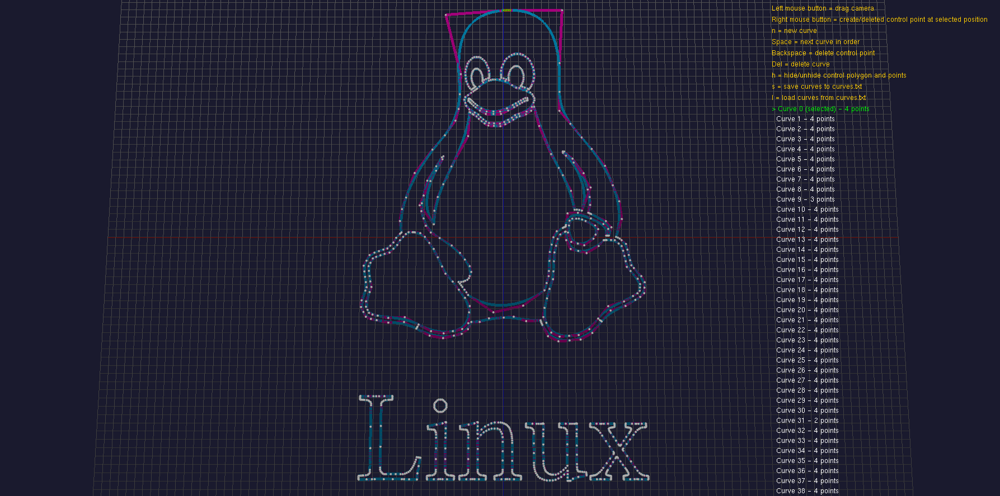

# Beziers3d


## Description
Beziers3d is an interactive 3D Bezier curve simulator developed as part of a Computer Graphics course. The tool allows for the creation and manipulation of Bezier control points within a 3D coordinate system. 

The project includes a Python-based preprocessing utility that parses SVG path data into a coordinate format compatible with the simulator, allowing for the spatial transformation and editing of 2D vector designs in a 3D environment.

---

## Example


---

## Features
- 3D Manipulation: Move control points along the X, Y, and Z axes to observe real-time curve deformation.

- SVG Integration: Convert standard .svg files into simulator-compatible coordinates.

- Reference Grid: A spatial guide to help visualize depth and scale.

- Pedagogical Tool: Designed to demonstrate the mathematical elegance of Bezier curves beyond flat planes.

## Installation

### Nix (Recommended)
This project provides a Nix flake for a reproducible development environment.
```bash
nix develop
# or if using direnv
direnv allow
```

### Linux (Ubuntu/Debian)
Install the required build tools and OpenGL development libraries:
```bash
sudo apt update
sudo apt install build-essential libgl1-mesa-dev libglu1-mesa-dev freeglut3-dev cmake
```

---

## Build and Execution

### Compilation
The project uses the standard CMake build pipeline:
```bash
mkdir build
cd build
cmake ..
make
```

### Execution
Run the generated binary from the build directory:
```bash
./app
```

---

## Usage

### Simulator Controls

| Input | Action |
| :--- | :--- |
| **Mouse Left** | Select control point at cursor position |
| **Mouse Right** | Create/delete control point at cursor position |
| **Mouse Wheel** | Zoom in / Zoom out |
| **Left Arrow** | Translate camera left |
| **Right Arrow** | Translate camera right |
| **Up Arrow** | Translate camera forward |
| **Down Arrow** | Translate camera backward |
| **H Key** | Toggle control polygon and points visibility |
| **N Key** | Instantiate new curve |
| **Space** | Cycle through curve list |
| **Backspace** | Remove selected control point |
| **Delete** | Remove selected curve |
| **L Key** | Load data from `curves.txt` |
| **S Key** | Serialize current curves to `curves.txt` |

### SVG Conversion Utility
Use the Python script to translate SVG paths into simulator-compatible point data:

```bash
python3 tools/svg_to_curves.py <input.svg> <output.txt>
```

The resulting file can be imported into the simulator using the **L** key.

---

## Technical Details
* **Graphics API:** OpenGL / GLUT
* **Build System:** CMake
* **Dependencies:** Python 3.x (for SVG conversion)
